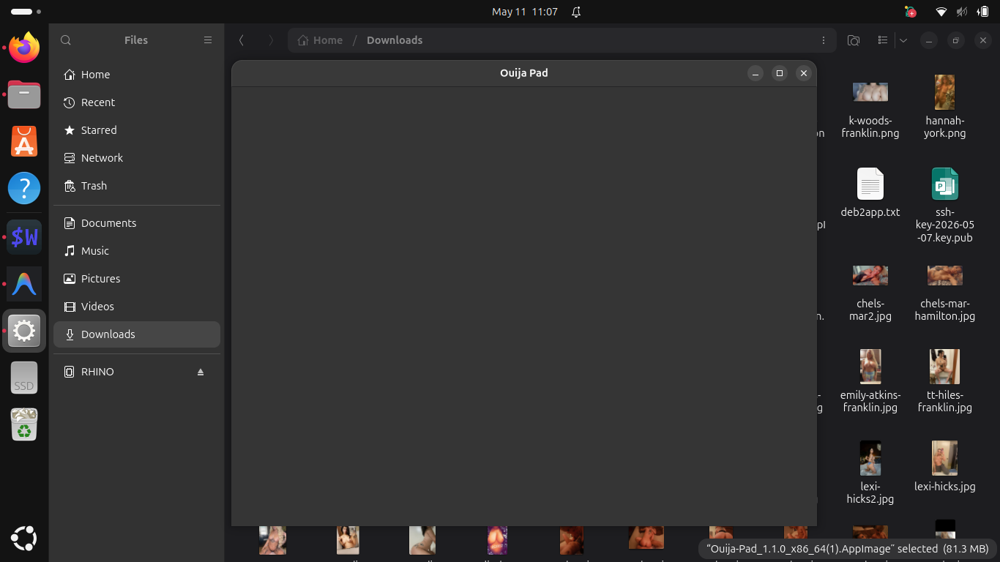

# Ouija Pad

<div align="center">
  

  **A gothic notepad with an immersive ouija board virtual keyboard**

  [](https://opensource.org/licenses/MIT)
  [](https://tauri.app/)
  [](https://www.linux.org/)
  [](https://github.com/BlancoBAM/Ouija-Pad/actions)
</div>

---

## ✨ Overview

Ouija Pad transforms your writing experience into something mystical. This distraction-free notepad features an interactive ouija board virtual keyboard where every keystroke brings the board to life — a planchette smoothly glides across the screen to pinpoint each character you channel.

Now a fully-featured text editor: open `.txt` and `.md` files, edit them, and save them back with native file dialogs. Built with **Tauri** for native Linux performance.



---

## 🔮 Features

### Text Editing
- **Open & Save Files** — Native file dialogs for opening `.txt` / `.md` files and saving your work
- **Save As** — Write to a new file at any time
- **Unsaved-changes indicator** — A `•` appears next to the filename whenever there are unsaved edits
- **Keyboard shortcuts** — `Ctrl+O` open, `Ctrl+S` save, `Ctrl+Shift+S` save as

### Interactive Board
- **Planchette Animation** — The pointer animates to the exact position for every letter, number, and punctuation mark using precise coordinate mapping
- **Dual Input Modes** — Click board hotspots directly or type on your physical keyboard; the planchette responds either way
- **Persistent Local Storage** — Content is auto-saved to LocalStorage and restored on next launch when no file is open

### Gothic Aesthetic
- **Dark Ambient Styling** — Custom gothic fonts (Creepster, Special Elite), ambient purple/gold gradients
- **Smooth Animations** — Cubic-bezier planchette transitions and keyboard dock interactions
- **Burn Page Protocol** — Confirmation-gated page clearing

---

## 📦 Installation

Download the latest release from the **[Releases page](https://github.com/BlancoBAM/Ouija-Pad/releases)**.

### Debian / Ubuntu (.deb)
```bash
sudo dpkg -i ouija-pad_*_amd64.deb
sudo apt-get install -f        # resolve dependencies if needed
```

### A̶p̶p̶I̶m̶a̶g̶e̶ (NOT WORKING-Ive left it so that someone can fix it if they care to install it outside of Lilith)
```bash
chmod +x Ouija-Pad_*_x86_64.AppImage
./Ouija-Pad_*_x86_64.AppImage
```

---

## 🛠️ Build from Source

### Prerequisites

```bash
# Rust toolchain
curl --proto '=https' --tlsv1.2 -sSf https://sh.rustup.rs | sh

# System libraries (Debian/Ubuntu)
sudo apt-get install -y \
    libgtk-3-dev \
    libwebkit2gtk-4.1-dev \
    libappindicator3-dev \
    librsvg2-dev \
    libssl-dev \
    pkg-config

# Node.js 20+
# https://nodejs.org
```

### Development

```bash
git clone https://github.com/BlancoBAM/Ouija-Pad.git
cd Ouija-Pad
npm install
npm run tauri:dev
```

### Production Build

```bash
# Build .deb + AppImage
npm run tauri:build -- --bundles deb,appimage

# Packages land in:
#   src-tauri/target/release/bundle/deb/
#   src-tauri/target/release/bundle/appimage/
```

---

## 🎮 Usage

| Action | Method |
|---|---|
| Open a file | `Ctrl+O` or **⬡ OPEN SCROLL** button |
| Save current file | `Ctrl+S` or **⬡ SEAL** button |
| Save to a new file | `Ctrl+Shift+S` or **⬡ INSCRIBE AS** button |
| Clear the page | **⬡ BURN PAGE** button |
| Hide/show ouija board | **▼ HIDE** / **▲ OUIJA KEYBOARD** |
| Input via board | Click any letter, number, or symbol hotspot |

---

## 📁 Project Structure

```
Ouija-Pad/
├── src/                      # Frontend (HTML + CSS + JS)
│   ├── index.html
│   ├── style.css
│   ├── script.js
│   └── ouija.webp            # Ouija board image
├── src-tauri/                # Tauri / Rust backend
│   ├── src/
│   │   ├── main.rs
│   │   └── lib.rs            # Tauri commands (open/save file)
│   ├── capabilities/
│   │   └── default.json
│   ├── icons/                # Application icons (all sizes)
│   ├── Cargo.toml
│   ├── Cargo.lock
│   ├── build.rs
│   └── tauri.conf.json
├── .github/
│   └── workflows/
│       └── build-release.yml # CI/CD pipeline
├── package.json
├── ouija-pad.desktop         # Linux desktop launcher
├── LICENSE
└── README.md
```

---

## 🚀 CI/CD

GitHub Actions builds on every push to `main` and creates a GitHub Release on every version tag:

```bash
git tag v1.2.0
git push origin v1.2.0
```

The pipeline will produce and attach:
- `ouija-pad_<version>_amd64.deb`
- `Ouija-Pad_<version>_x86_64.AppImage`

Workflow: [`.github/workflows/build-release.yml`](.github/workflows/build-release.yml)

---

## 🛠️ Technology Stack

| Layer | Technology |
|---|---|
| Frontend | HTML5, CSS3, Vanilla JavaScript |
| Desktop Runtime | Tauri 2.x (Rust + WebKit2GTK) |
| File I/O | `tauri-plugin-dialog` + `std::fs` |
| Fonts | Creepster, Special Elite, Inter (Google Fonts) |
| Storage | Browser LocalStorage (unsaved sessions) |
| Packaging | Tauri bundler (.deb, AppImage) |

---

## 🔀 Related Projects

- **[Keyuijaboard](https://github.com/BlancoBAM/keyuijaboard)** — A floating, always-on-top version of the ouija keyboard for system-wide text input

---

## 📄 License

**MIT License** — Copyright (c) 2026 Lilith Linux Team

See [LICENSE](LICENSE) for full text.

---

<div align="center">

**Channel your thoughts from beyond...** 🕯️

Made for Lilith Linux

</div>
